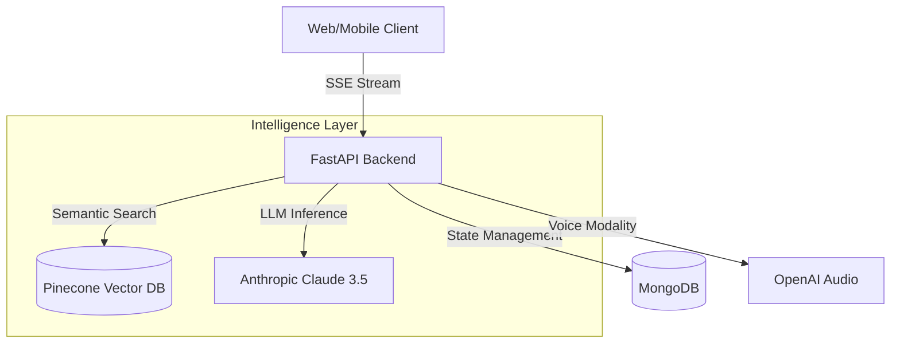

<div align="center">
  
  <h1>Tammy AI</h1>
  <p><strong>The Emotionally Intelligent Digital Co-Founder for Entrepreneurs</strong></p>

  <p>
    <a href="https://github.com/abdullatam/tammyai/actions"></a>
    <a href="https://fastapi.tiangolo.com/"></a>
    <a href="https://reactjs.org/"></a>
    <a href="https://www.mongodb.com/"></a>
    <a href="https://www.anthropic.com/"></a>
  </p>

  <p>
    <em>Tammy is not just a chatbot. She is a memory-persistent, emotionally aware, proactive intelligence designed to unlock the psychology and potential of founders.</em>
  </p>
</div>

---

## 🌌 Vision

Building a company is the ultimate psychological gauntlet. Founders face daily isolation, decision fatigue, and emotional burnout. Tammy exists to bridge the gap between human psychology and artificial intelligence. 

She doesn’t just answer questions—she tracks your emotional arc, spots your blindspots, holds you accountable to your decisions, and connects you with a curated network of peers. She is the infrastructure for emotional intelligence.

## ✨ Core Features

* **🧠 Semantic Memory Engine:** Tammy remembers everything. Using Pinecone vector embeddings, she recalls past decisions, relationships, and context flawlessly across sessions.
* **❤️ Emotional Intelligence (EQ):** A background state machine tracks your emotional valence and arousal, flagging unresolved "emotional threads" for future check-ins.
* **🎙️ Voice & Streaming:** Real-time, interruptible voice conversations powered by OpenAI Whisper/TTS and Anthropic Claude via SSE streaming.
* **🧬 Founder DNA:** An automated profiling system that categorizes your leadership style, cognitive biases, and communication patterns.
* **🔮 The Mirror Moment:** A hard-truth, earned summary of your recent avoidance patterns and challenges, generated purely from your raw conversation data.
* **🌐 Tammy Connect:** An AI-driven networking layer that spots complementary skills between founders and orchestrates double-opt-in warm introductions.
* **🌍 Bilingual Context:** Native fluency and cultural awareness in both Arabic and English.

---

## 🏗️ Architecture Overview

Tammy's architecture is designed for low-latency, real-time AI orchestration. 



### Directory Structure
```text
tammyai/
├── frontend/          # React web client and Admin dashboard
├── backend/           # Core FastAPI server and REST routes
├── ai/                # LLM orchestration, memory, and RAG pipelines
├── infrastructure/    # Deployment, Docker, and CI/CD configs
├── docs/              # Comprehensive platform documentation
└── scripts/           # Utility scripts for DB management and testing
```

---

## 🚀 Getting Started

### Prerequisites
- Python 3.10+
- MongoDB instance (local or Atlas)
- Pinecone Account & Index
- API Keys: Anthropic, OpenAI, Speechmatics

### Installation

1. **Clone the repository:**
   ```bash
   git clone https://github.com/abdullatam/tammyai.git
   cd tammyai
   ```

2. **Set up the virtual environment:**
   ```bash
   python3 -m venv .venv
   source .venv/bin/activate
   pip install -r requirements.txt
   ```

3. **Configure Environment Variables:**
   Copy the example environment file and fill in your keys:
   ```bash
   cp .env.example .env
   ```

4. **Start the Platform:**
   We provide a convenient bash script to start the server:
   ```bash
   ./run_tammy.sh
   ```
   *The backend will boot on `http://localhost:7861` and serve the React frontend automatically.*

---

## 🎨 Design Philosophy

Tammy is designed to feel **intimate, deep, warm, sharp, and cultural.**
We completely avoid the "generic AI" aesthetic (no sterile gradients or robotic UI). Instead, the interface relies on deep irises, warm ivories, and natural, fluid animations (The Orb system) to make the user feel heard and grounded.

---

## 🔒 Security & Privacy

Founder data is highly sensitive. Tammy is built with privacy at its core:
- All semantic memories are strictly partitioned by `user_id` at the vector-database level.
- Conversation payloads are never used to train base foundation models.
- JWT and secure HTTP-only cookies handle all session authentication.

---

## 🤝 Contributing

We welcome contributions from engineers who are passionate about AI, psychology, and design.
Please read our [CONTRIBUTING.md](docs/CONTRIBUTING.md) to understand our architectural principles and commit conventions.

---

## 📄 License

Tammy AI is proprietary software. All rights reserved.
