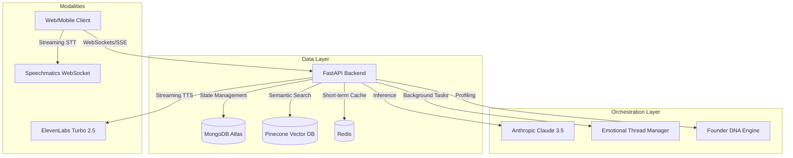
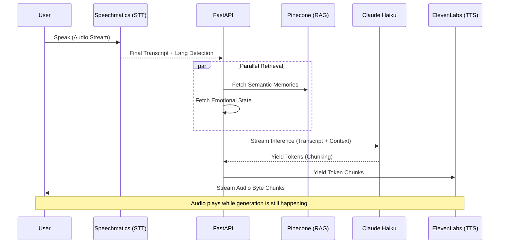
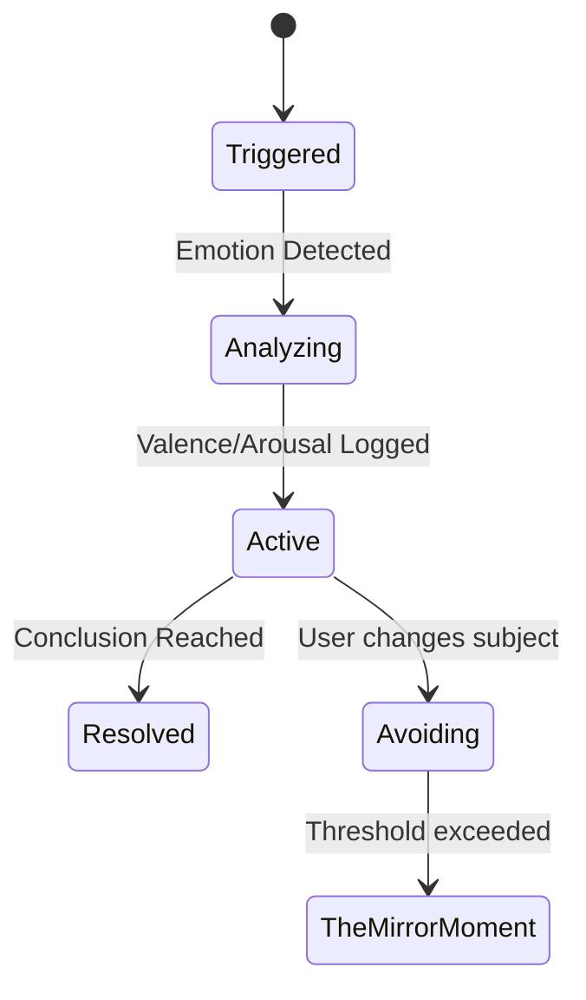
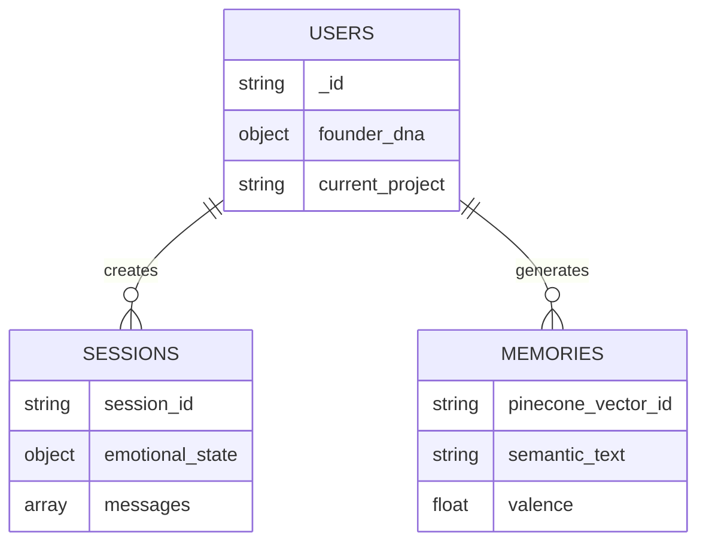

  
  <h1>Tammy AI Infrastructure</h1>
  
<strong>The Real-Time, Emotionally Intelligent Co-Founder Architecture</strong>

  

    
    
    
    
    
    
  

  

    <em>A masterclass in low-latency AI orchestration, semantic memory persistence, and asynchronous emotional state-machine management.</em>
  

---

## 🌌 System Architecture

Tammy is a decoupled, event-driven platform designed to simulate fluid, human-like intelligence. The system relies on a heavily optimized FastAPI event loop, parallel worker pipelines, and streaming modalities to achieve sub-1.5 second conversational latency.

---

## 🎙️ The Voice Pipeline: Deep Dive

Tammy’s voice architecture is built for **human-level real-time responsiveness**. We bypass traditional monolithic request/response cycles in favor of aggressively overlapped streaming chunks. 

Our target latency (End of user speech to start of AI audio playback) is **~1.0–1.5 seconds**.

### 1. Voice Architecture Overview
The voice system uses a decoupled frontend-backend WebSocket mesh. The client streams raw audio directly to our STT provider, the backend captures the text, injects RAG/Memory context in parallel, streams tokens from Claude Haiku, and pipes those tokens immediately into ElevenLabs chunk streaming.

### 2. Real-Time Streaming Pipeline

### 3. STT Layer (Speechmatics)
We utilize **Speechmatics Real-Time WebSockets** for Speech-to-Text because of its superior performance with rapid bilingual switching (Arabic/English) and low-latency chunking.

### 4. LLM Streaming Layer
For voice, we route through **Claude Haiku** (or equivalent ultra-low latency models) instead of Sonnet. The model is specifically prompted to generate conversational, un-bulleted, concise text optimized for human speech.

### 5. Memory Injection Timing
The moment the STT transcript triggers the "End of Utterance" flag, the backend fires an asynchronous `asyncio.gather()` task to fetch Pinecone vectors. This happens in **< 80ms** before the LLM prompt is assembled.

### 6. RAG Parallel Retrieval
If a query requires deep knowledge (e.g., "What did my investor say last week?"), the RAG pipeline fires in parallel to the short-term memory fetch, ensuring zero blocking on the main event loop.

### 7. TTS Chunk Streaming
We utilize **ElevenLabs Turbo v2.5**. Rather than waiting for the LLM to finish its entire response, the backend aggregates LLM tokens until it hits a natural punctuation mark (comma, period), and sends that chunk to ElevenLabs via WebSockets. 

### 8. Audio Playback Engine
The frontend uses the Web Audio API to queue and decode MP3 byte streams the moment they arrive via SSE. This reduces perceived latency to near zero.

### 9. Interrupt Handling
The client maintains a local `isSpeaking` state. If the user begins speaking while Tammy is playing audio, the frontend instantly kills the AudioContext queue and sends an `INTERRUPT` flag to the backend to kill the active generator.

### 10. Silence Detection Optimization
To prevent awkward pauses, the STT layer uses a dynamic silence threshold (VAD). If the user pauses for `0.8s` but the sentence is syntactically incomplete, the system waits. If syntactically complete, it fires immediately.

### 11. Latency Breakdown
| Stage | Tech Stack | Latency Target |
|-------|------------|----------------|
| VAD & End of Speech | Speechmatics | `~300ms` |
| RAG & Context Fetch | Pinecone / Mongo | `~80ms` (Parallel) |
| TTFT (Time to First Token) | Claude Haiku | `~400ms` |
| Text to First Audio Byte | ElevenLabs Turbo | `~300ms` |
| **Total Perceived Latency** | | **~1,080ms** |

### 12. Arabic/English Auto Detection
Speechmatics automatically tags the detected language. Tammy dynamically adjusts her ElevenLabs voice model and LLM prompt to respond in the native tongue of the user seamlessly.

### 13. WebSocket Lifecycle
1. Frontend initializes STT websocket.
2. Frontend opens an SSE connection to FastAPI `/api/voice/stream`.
3. Heartbeats keep the connection alive.
4. On interruption, the SSE channel is aggressively closed and recycled.

### 14. Parallel Worker Architecture
To prevent the FastAPI event loop from starving during heavy audio chunk processing, TTS socket handling is offloaded to a dedicated ThreadPoolExecutor.

### 15. Performance Optimization
- **Redis Caching:** RAG embeddings are cached via LRU in Redis.
- **Connection Pooling:** MongoDB and Pinecone utilize persistent HTTP/TCP pools.

### 16. Failure Recovery
If the SSE stream dies, the frontend falls back to standard HTTP chunked polling. If ElevenLabs rate-limits, we seamlessly fallback to OpenAI TTS `tts-1` model.

### 17. Future Voice Roadmap
- Transitioning to WebRTC for bi-directional audio to shave off 200ms of TCP overhead.
- Integrating native GPT-4o real-time voice APIs once natively available for our specific emotional tone parameters.

---

## ❤️ Emotional Intelligence Engine

Tammy does not view conversations linearly. She views them as **Emotional Threads**.

### The Mirror Moment
A completely automated, asynchronous cron job evaluates `Avoiding` threads. If avoidance patterns emerge (e.g., dodging questions about runway), Tammy orchestrates a "Hard Truth" summary designed to therapeutically confront the founder.

---

## 🗄️ Database Relationships

---

## 🚀 Getting Started

1. **Clone the repository:** `git clone https://github.com/abdullatam/tammyai.git`
2. **Set up virtual environment:** `python3 -m venv .venv && source .venv/bin/activate`
3. **Configure Environment:** Copy `.env.example` to `.env` and insert your API keys.
4. **Boot Backend:** `./run_tammy.sh` (Starts FastAPI on `http://localhost:7861`)

---

## 🤝 Contributing
Please read our [CONTRIBUTING.md](docs/CONTRIBUTING.md) to understand our architectural principles. PRs should target `develop`.

---
*Tammy AI is proprietary software.*
