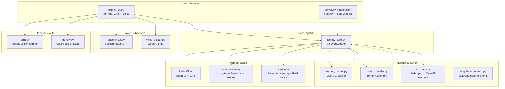
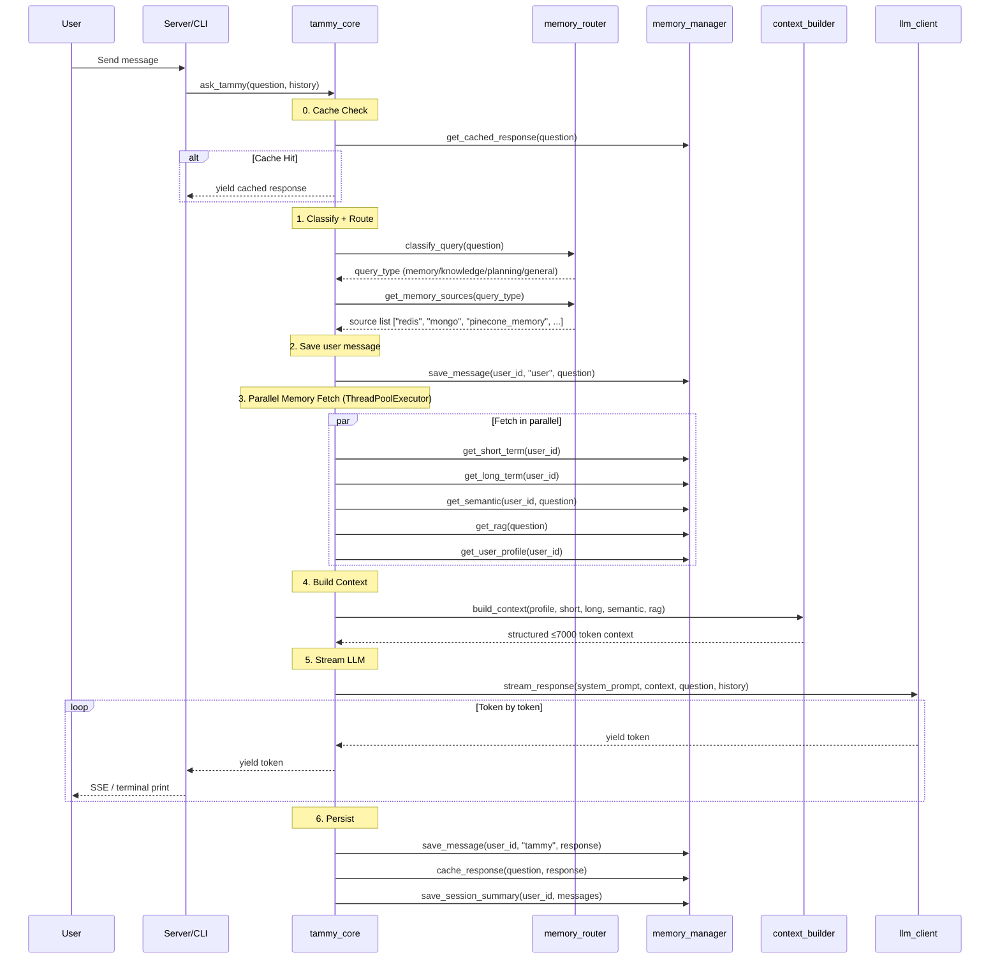
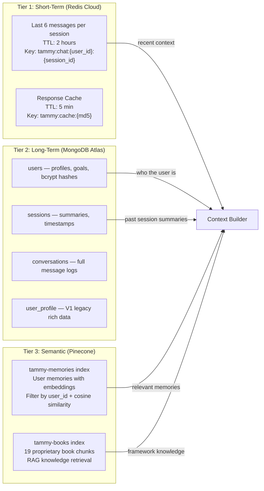
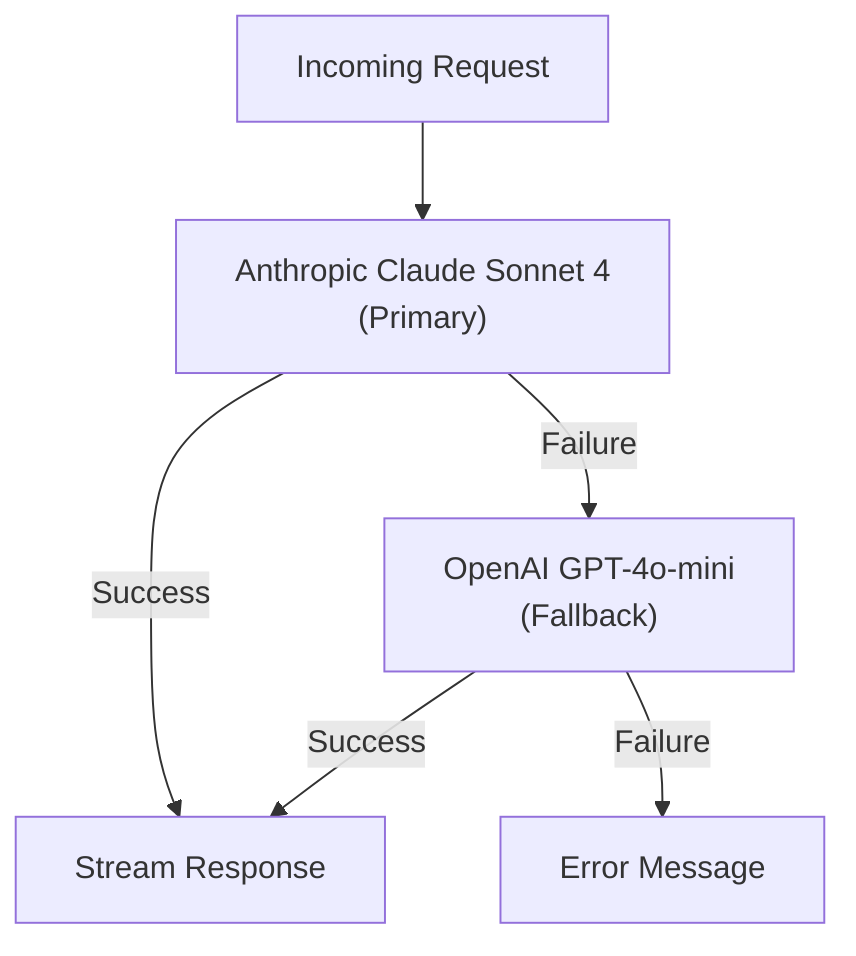
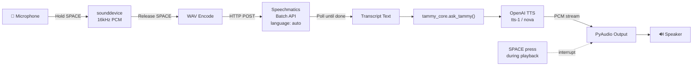
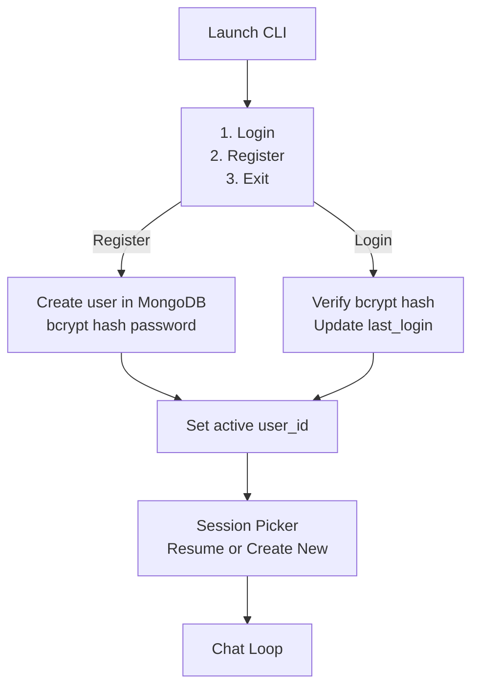
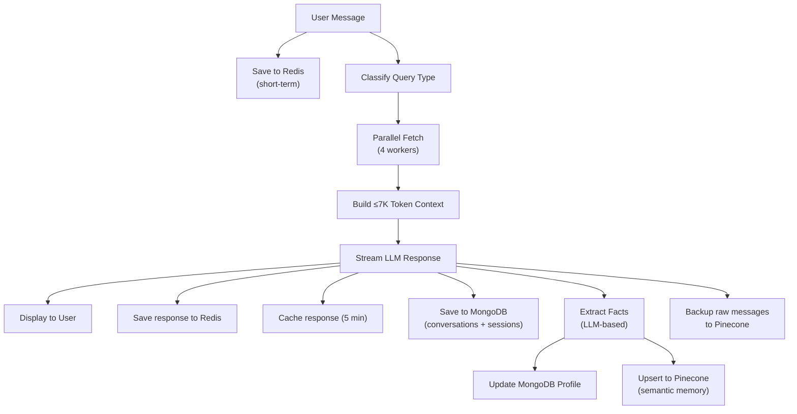

# 🏗️ Tammy AI — Full System Architecture

> **Tammy** is a conversational AI "clarity partner" — not a chatbot, but a persistent, emotionally intelligent companion powered by a custom system prompt, multi-tier memory, RAG over 19 proprietary books, and real-time voice I/O.

---

## High-Level System Diagram



---

## Module Map (20 Files)

| Module | Role | Lines |
|--------|------|-------|
| [tammy_core.py](file:///Users/abdullatamimi/Desktop/tammy/tammy/tammy_core.py) | **V2 Orchestrator** — classify → route → retrieve → context → stream → save | 146 |
| [tammy_rag.py](file:///Users/abdullatamimi/Desktop/tammy/tammy/tammy_rag.py) | **RAG Pipeline** — system prompt, LangChain chain, parallel memory fetch | 603 |
| [server.py](file:///Users/abdullatamimi/Desktop/tammy/tammy/server.py) | **FastAPI backend** — SSE streaming `/chat/stream`, memory clear, health check | 104 |
| [tammy_cli.py](file:///Users/abdullatamimi/Desktop/tammy/tammy/tammy_cli.py) | **Terminal CLI** — auth flow, session picker, text/voice I/O, `--voice` flag | 269 |
| [index.html](file:///Users/abdullatamimi/Desktop/tammy/tammy/static/index.html) | **Web Chat UI** — vanilla JS/CSS dark theme with SSE streaming | 517 |
| [memory_manager.py](file:///Users/abdullatamimi/Desktop/tammy/tammy/memory_manager.py) | **Unified memory interface** — read/write for all 3 stores | 417 |
| [memory_router.py](file:///Users/abdullatamimi/Desktop/tammy/tammy/memory_router.py) | **Query classifier** — keyword heuristics → memory/knowledge/planning/general | 90 |
| [context_builder.py](file:///Users/abdullatamimi/Desktop/tammy/tammy/context_builder.py) | **Prompt assembler** — builds ≤7000 token context from memories | 84 |
| [llm_client.py](file:///Users/abdullatamimi/Desktop/tammy/tammy/llm_client.py) | **LLM streaming** — Anthropic primary, OpenAI fallback | 125 |
| [langchain_connect.py](file:///Users/abdullatamimi/Desktop/tammy/tammy/langchain_connect.py) | **LangChain wiring** — ChatAnthropic + ChatOpenAI with fallbacks, embeddings, vectorstore | 92 |
| [pinecone_manager.py](file:///Users/abdullatamimi/Desktop/tammy/tammy/pinecone_manager.py) | **Pinecone singleton** — semantic memory + RAG queries + memory upsert | 199 |
| [redis_client.py](file:///Users/abdullatamimi/Desktop/tammy/tammy/redis_client.py) | **Redis singleton** — connection pool, graceful fallback | 85 |
| [mongodb_client.py](file:///Users/abdullatamimi/Desktop/tammy/tammy/mongodb_client.py) | **MongoDB singleton** — Atlas connection, collection exports | 91 |
| [auth.py](file:///Users/abdullatamimi/Desktop/tammy/tammy/auth.py) | **Authentication** — bcrypt register/login via MongoDB | 96 |
| [identity.py](file:///Users/abdullatamimi/Desktop/tammy/tammy/identity.py) | **Session identity** — global user_id + session_id state | 37 |
| [save_session.py](file:///Users/abdullatamimi/Desktop/tammy/tammy/save_session.py) | **Session persistence** — MongoDB sessions + Pinecone semantic backup | 151 |
| [voice_input.py](file:///Users/abdullatamimi/Desktop/tammy/tammy/voice_input.py) | **Push-to-talk STT** — Speechmatics Batch API, auto language detection | 221 |
| [voice_output.py](file:///Users/abdullatamimi/Desktop/tammy/tammy/voice_output.py) | **TTS playback** — OpenAI TTS streaming PCM via PyAudio, interruptible | 103 |
| [config.py](file:///Users/abdullatamimi/Desktop/tammy/tammy/config.py) | **Centralized config** — env vars for all services | 72 |
| [constants.py](file:///Users/abdullatamimi/Desktop/tammy/tammy/constants.py) | **App constants** — roles, messages, defaults | 78 |
| [logger.py](file:///Users/abdullatamimi/Desktop/tammy/tammy/logger.py) | **Logging setup** | ~50 |

---

## 🔄 Request Pipeline (V2 — `tammy_core.py`)



---

## 🧠 Memory Architecture (3-Tier)



### Memory Routing Table

| Query Type | Sources Loaded | Example Triggers |
|------------|---------------|------------------|
| **memory** | Redis + MongoDB + Pinecone Memory | "remember", "last time", "my name", "who am I" |
| **knowledge** | Pinecone RAG (books) | "how to", "explain", "framework", "EGG method" |
| **planning** | Redis + MongoDB + Pinecone Memory | "plan", "next step", "should I", "roadmap" |
| **general** | Redis + Pinecone Memory | Everything else |

### Time-Aware Memory

Every memory carries a timestamp and gets a human-readable label:
- `[today]`, `[yesterday]`, `[3 days ago]`, `[2 weeks ago]`, etc.
- Resolution windows auto-expire stale states (illness: 14 days, grief: 90 days, excitement: 3 days)

---

## 🤖 LLM Strategy



- **Primary**: Claude Sonnet 4 via Anthropic API
- **Fallback**: GPT-4o-mini via OpenAI API
- **Embeddings**: OpenAI `text-embedding-3-small`
- **Streaming**: Token-by-token for terminal + SSE for web
- **Temperature**: 0.7 (configurable)
- **Max tokens**: 2000

---

## 🎤 Voice Subsystem



- **STT**: Speechmatics Batch API with auto language detection (Arabic + English)
- **TTS**: OpenAI `tts-1` model, `nova` voice, streaming PCM
- **Interaction**: Push-to-talk (hold SPACE), interruptible playback (press SPACE)

---

## 🔐 Authentication Flow (CLI)



---

## 🌐 Two Interface Modes

````carousel
### 1. Terminal CLI (Primary)
**Entry**: `python tammy_cli.py` or `python tammy_cli.py --voice`

```
tammy_cli.py
  ├── Authentication (login/register)
  ├── Session management (resume/create)
  ├── Text mode (streaming terminal output)
  └── Voice mode (push-to-talk + TTS playback)
```

- Full auth flow with bcrypt
- Session isolation per conversation
- `--voice` flag enables Speechmatics + OpenAI TTS
<!-- slide -->
### 2. Web UI (FastAPI + SSE)
**Entry**: `python server.py` → `localhost:7861`

```
server.py (FastAPI)
  ├── GET  /           → static/index.html
  ├── POST /chat/stream → SSE token stream
  ├── POST /memory/clear
  └── GET  /health
```

- Vanilla HTML/CSS/JS dark theme
- Real-time SSE streaming with typing cursor animation
- Sidebar with status indicators
````

---

## 🧬 System Prompt & Persona

Tammy's system prompt (~4500 tokens) defines a deeply engineered persona:

| Aspect | Design |
|--------|--------|
| **Core Identity** | "The sharp friend who tells the truth" — not assistant, not therapist |
| **Response Pattern** | Insight → Tension → Question (never empathy → validation → soft question) |
| **Emotional Model** | GoEmotions 27-category + PAD 3D arousal-valence-dominance |
| **Knowledge Base** | 19 proprietary books (EGG, Threadkeeper, Alchemy, etc.) — never reproduced raw |
| **Formatting** | No markdown, no bold, no headers. Plain prose. One question per response. |
| **Banned Phrases** | "Of course", "Absolutely!", "As an AI", "That sounds hard", "Give yourself permission" |

---

## 📊 Data Flow Summary



---

## 🔧 Infrastructure

| Service | Provider | Purpose |
|---------|----------|---------|
| **Redis** | Redis Cloud | Short-term chat buffer, response cache |
| **MongoDB** | MongoDB Atlas | User profiles, sessions, conversations, auth |
| **Pinecone** | Pinecone (2 indexes) | Semantic memory (`tammy-memories`) + RAG knowledge (`tammy-books`) |
| **Anthropic** | Claude Sonnet 4 | Primary LLM |
| **OpenAI** | GPT-4o-mini + Embeddings + TTS | Fallback LLM, text-embedding-3-small, tts-1 |
| **Speechmatics** | Batch API | Multi-language STT (auto-detect Arabic/English) |

---

## 🛡️ Resilience Patterns

- **All DB clients are singletons** with connection pooling and graceful degradation
- **Redis unavailable?** → Short-term memory disabled, app continues
- **MongoDB unavailable?** → Long-term memory disabled, app continues
- **Pinecone unavailable?** → Semantic memory + RAG disabled, app continues
- **Anthropic fails?** → Automatic fallback to OpenAI GPT-4o-mini
- **Both LLMs fail?** → User-facing error message
- **Voice fails?** → Automatic fallback to text input
